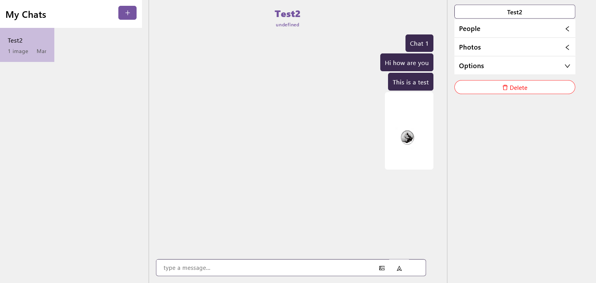

# A react chat application using ChatEngine API

## Overview

This application is capable of hosting multiple users. You can send texts, images and view chat read notifications if other members have seen your chat.

This application was built using [Chat Engine](chatengine.io) API.

## Screenshots

#### Chatting Window

#### Login Page

